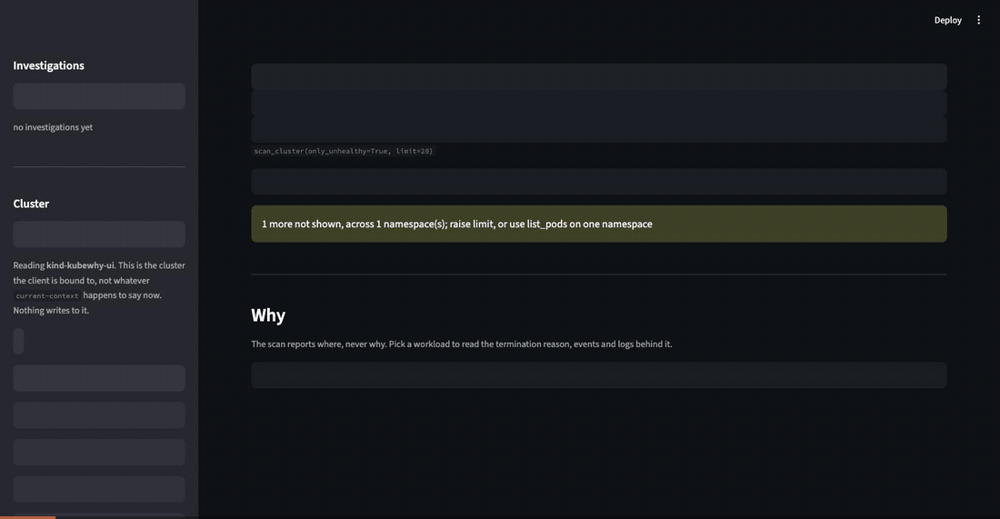
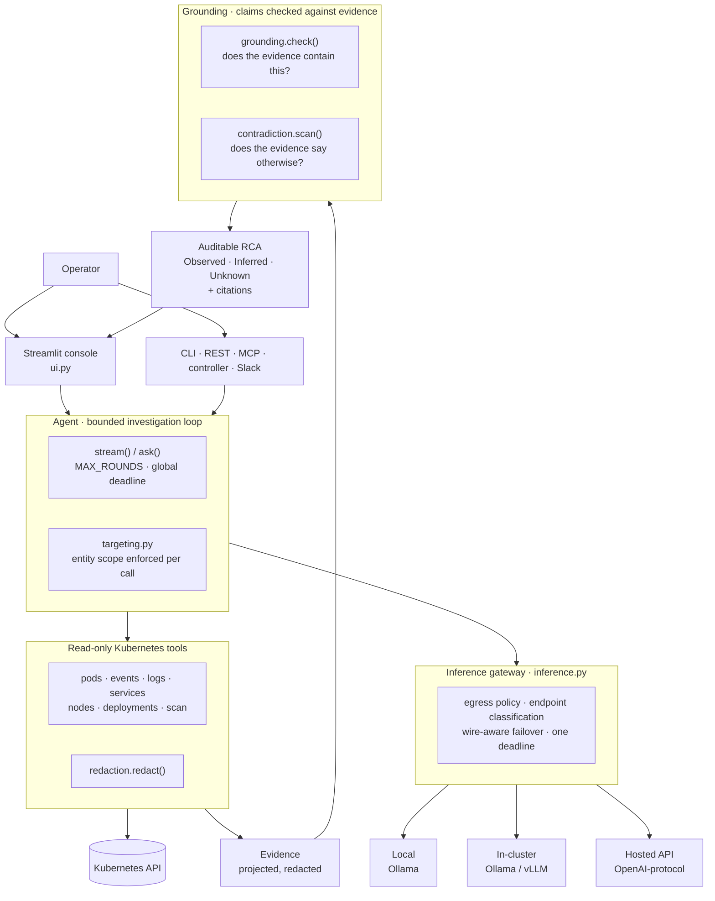

# kubewhy

[](https://github.com/ravisinghrajput95/kubewhy/actions/workflows/tests.yml)
[](LICENSE)
[](requirements.txt)
[](#use-it-from-claude-cursor-or-any-mcp-client)

kubewhy is an **evidence-first Kubernetes AIOps investigation agent**. It
collects Kubernetes evidence, reasons over that evidence using configurable LLM
inference, validates every claim against the evidence it collected, and presents
an auditable root-cause analysis.



*A real investigation on a kind cluster with a local model. Nothing scripted —
the 46.6s in the verdict strip is the model thinking.*

## Why kubewhy?

Pointing a language model at a Kubernetes cluster produces a specific set of
failures, and each one is a design problem rather than a prompting problem:

| Failure | What kubewhy does about it |
|---|---|
| **Hallucinated causes** — a plausible sentence with no measurement behind it | Every claim is checked against collected evidence. Unsupported figures are rewritten in place as `[unverified: …]`, not left to read as fact |
| **Lost entity scope** — asked about one workload, answers about a louder broken neighbour | The target is fixed before the first round and every tool call is enforced against it. Off-target calls are rewritten or refused |
| **Overstated conclusions** — a guess presented with the confidence of a measurement | Five verdicts, including `insufficient_evidence` and `contradicted`. Claims split into Observed / Inferred / Unknown |
| **Status mistaken for cause** — "CrashLoopBackOff" is where, not why | The scan reports *where*; the cause always costs a follow-up call. A deterministic policy sends a run back when it stops before reading the evidence that holds the answer |
| **Evidence leaving the network** | Local inference is the default and it is enforced, not documented. External endpoints refuse to start without an explicit flag, and logs are redacted at collection and again at the egress boundary |
| **Runs that never end** | One deadline per investigation, shared across primary and fallback. A fallback cannot reset it |
| **Provider lock-in** | Where inference happens is configuration. The loop cannot tell which backend it has |

The distinction that makes this work: **the model chooses how to investigate; it
does not decide what is true, what it is investigating, or when to stop.** Those
are deterministic code, covered by unit tests. See the
[deterministic-versus-model table](docs/ARCHITECTURE.md#deterministic-code-versus-model-behaviour).

## Key capabilities

- **Evidence-first investigation** — a bounded loop that collects before it concludes
- **Kubernetes-native tools** — fourteen read-only collectors returning projections, not raw API objects
- **Entity-scoped investigations** — the target is enforced on every tool call
- **Grounded claims** — each observation carries the `tool.field` it came from
- **Contradiction detection** — a separate deterministic stage; "the tools did not say" and "the tools said otherwise" are different verdicts
- **Observed / Inferred / Unknown** — the answer split by how well it is supported
- **Three inference modes** — local, in-cluster, or a hosted API
- **Provider abstraction** — one gateway; the loop is unchanged across backends
- **Wire-aware failover** — mid-run only between providers sharing a wire format
- **Read-only RBAC** — a ClusterRole with no write verbs
- **Evidence redaction** — at collection and at the egress boundary
- **External-data policy** — external inference refuses to start without an explicit opt-in
- **NetworkPolicy support** — the dataplane enforces the claim rather than this process promising it
- **Bounded investigation lifecycle** — a global deadline, not a per-request timeout
- **Streamlit operator console** — the investigation as an auditable object

## Architecture



**Grounding sits between the investigation and the diagnosis.** The model never
hands you a conclusion the evidence has not been checked against.

## An example investigation

Real, from the recording above — `demo/memory-hog` on a kind cluster, local
`qwen3`:

**Question** — *why is demo/memory-hog failing?*

**Evidence collected** (2 tool calls, 46.6s, 3 model rounds)

```
scan_cluster(workload=demo/memory-hog)
describe_pod(name=memory-hog-bc76968c6-6xflg, namespace=demo)
```

```json
{"demo/memory-hog": {"status": "OOMKilled", "pods": 1, "fault": "crash"}}
{"containers": {"hog": {"limits": {"memory": "64Mi"},
                        "restarts": 65,
                        "last_termination": {"reason": "OOMKilled",
                                             "exit_code": 137}}}}
```

**Grounding** — verdict `grounded`. Observed · 5, Inferred · 0, Unknown · 0:

| claim | traced to |
|---|---|
| `oomkilled` | `scan_cluster.demo/memory-hog.status` |
| `65` | `describe_pod.containers.hog.restarts` |
| `64` | `describe_pod.containers.hog.limits.memory` |

**Root cause**

> The pod `memory-hog-bc76968c6-6xflg` is crashing due to **OOMKilled**
> (Out-Of-Memory Killed) with 65 restarts. Its memory limit of **64Mi** is
> insufficient for its workload, likely caused by the `polinux/stress` container
> exceeding allocated resources.

Every figure in that sentence is in the table above. That is the whole point.

## Security model

- **Read-only Kubernetes access.** A ClusterRole with no write verbs. There is no
  apply, scale or delete path in the code.
- **Collection-time redaction.** `redaction.py` strips AWS keys, GitHub and Slack
  tokens, JWTs, private keys, URL passwords, `KEY=value` secrets and bearer
  headers from pod logs before they reach the model or your terminal. It is
  pattern matching and it will miss novel formats.
- **Egress-boundary redaction.** Outbound messages get a second pass at the
  boundary.
- **External-data policy.** `TRIAGE_INFERENCE_MODE=api` moves the boundary
  deliberately and additionally requires `TRIAGE_ALLOW_EXTERNAL_INFERENCE`. An
  external endpoint without it refuses to start; a request to one is a 403, not a
  500, because a 500 reads as a bug and gets retried. A fallback is not a way
  around it.
- **NetworkPolicy.** `networkPolicy.enabled=true` makes the claim a property the
  dataplane enforces. Validated on GKE with Calico.
- **Credentials stay server-side.** Streamlit renders server-side; the browser
  holds no Kubernetes client and no provider key. Pinned by
  `tests/test_ui_security.py`.
- **An audit record per investigation.** Who asked, through which surface, the
  redacted question, every tool called and with what arguments, which pods'
  logs were read, the verdict, and whether evidence could have left the
  network. Emitted for abandoned and failed runs too. It deliberately does
  **not** carry the tool output, the answer, the inference endpoint or an
  exception message — an audit log is shipped centrally and kept for a long
  time, and a copy of your pod logs does not belong in one.

Full threat model: [docs/SECURITY.md](docs/SECURITY.md).

## Inference modes

| Mode | Where the model runs | Evidence destination | Status |
|---|---|---|---|
| `local` (default) | your workstation, via Ollama | on-network | **validated** |
| `cluster` | a pod in this cluster | on-network | **validated with in-cluster Ollama** |
| `api` | a hosted OpenAI-protocol endpoint | **external** | **validated live against OpenAI** |

The `vllm` provider is the OpenAI wire protocol under another name. It is
**protocol-level support only** — validated against a local Ollama `/v1`
endpoint, and **never run against a real vLLM server**.

Details: [docs/INFERENCE.md](docs/INFERENCE.md).

## Validation

| Capability | Evidence |
|---|---|
| Automated tests | 977 passing |
| Grounding replay | 907 recorded runs, no regressions |
| AI evaluation | 29 scenarios × 5 runs per configuration |
| GKE runtime | Validated |
| GKE / Calico NetworkPolicy | Validated |
| RBAC | Runtime validated |
| Local Ollama | Validated |
| OpenAI API | Live validated |
| In-cluster inference | Validated (Ollama) |
| Real vLLM | **Not tested** |
| EKS | **Not tested** |
| Browser paint automation | **Not tested** |
| Generalized AI diagnostic accuracy | **Not established** |

The defects found during development — an egress bypass, a target-extraction
failure, two contradiction false-positive classes — are documented with their
detection, root cause, fix and regression evidence in
[docs/VALIDATION.md](docs/VALIDATION.md).

## AI evaluation

29 scenarios with declared ground truth, run 5 times per configuration against a
live cluster:

| | qwen3 (local) | gpt-4o-mini (API) |
|---|---|---|
| RCA correct | 127/145 | 132/145 |
| Contradicted claims | 9 | 3 |
| Unsupported claims | 42 | 10 |
| `insufficient_evidence` | 14 | 32 |
| Median / p95 latency | 73s / 188s | 6s / 14s |

**Overall model comparison: UNDETERMINED.** Paired at the scenario level — both
configurations see the same scenarios — 19 of 29 are identical and a two-sided
sign test gives **p = 0.3438**. The sample does not separate them.

**91% is not a diagnostic accuracy figure and must not be read as one.** It is a
pass rate on 29 hand-built scenarios, on one cluster, with one prompt
configuration. Four individual scenarios do separate the two models completely,
but none survives multiplicity correction — at 5-versus-5 the design cannot
reach that threshold. They are reproducible leads, not proven claims.

Methodology, metrics and what the numbers do not support:
[docs/AI_EVALUATION.md](docs/AI_EVALUATION.md).

## Limitations

Measurement scope:

- **One cluster, one machine, one prompt configuration.** Everything measured
  here was measured there.
- **n=5 per scenario, 29 scenarios.** Enough to make per-scenario behaviour
  reproducible; not enough to rank two configurations. The overall model
  comparison is UNDETERMINED.
- **Generalized diagnostic accuracy is not established** and is not claimed.
- **Answers vary between runs.** The same question can produce a different chain.
  The `confidence` field and the `tool_calls` trace tell you which measurements
  an answer actually rests on.

Not tested:

- **Real vLLM.** The `vllm` provider is the OpenAI wire protocol under another
  name, validated against a local Ollama `/v1` endpoint. It has never been run
  against an actual vLLM server.
- **EKS.** AKS and GKE have both been run against for real, including GKE's exec
  credential plugin and a live token expiry. EKS auth is verified by reading the
  client rather than by running against one.
- **Browser visual validation.** `AppTest` asserts the element tree, not the
  painted page — escaped markup, clipping and invisible text are structurally
  invisible to it. [docs/E2E.md](docs/E2E.md) designs the browser suite; none of
  it is implemented.
- **Mutation testing.** The harness used during development is not part of this
  repository.

Product boundaries:

- **The scan reports where, never why.** `--scan` finds failing workloads across
  every namespace in one API call, but the cause of any one of them still costs
  a full diagnosis — so `--explain` is bounded to a few workloads rather than
  the whole list.
- **The console authenticates but does not authorize.** `ui.auth.enabled=true`
  puts an OIDC proxy in front and binds the console to loopback behind it;
  everyone who signs in still sees everything the ServiceAccount can read.
  kubewhy is built for one team against one cluster, and the ClusterRole is
  where that is narrowed. Without that switch there is no authentication at
  all, and the chart requires an explicit acknowledgement to expose it.
- **The controller holds dedup state in memory by default**, so a restart forgets
  what it already reported. `persistence.enabled=true` fixes the restart case; it
  does not buy a second replica. One replica stays pinned either way.
- **`/ask` holds a request open** for the whole run; `/ask/stream` makes the wait
  legible without shortening it. `/ask/jobs` detaches the work, but the result
  lives in this process's store — one replica or nothing.
- **Cumulative context is unbounded.** Per-call output is projected, but a long
  chain over a busy namespace can still grow past the window.
- **Requires a tool-capable model.** Models without a thinking mode fall back
  automatically but score materially worse.
- **Latency.** Tens of seconds per diagnosis on a local model. `kubectl describe`
  is faster when you already know where to look.
- **No rate limiting**, and no lockfile.
- **One replica of each component.** The controller's dedup state and the
  console's investigation history are per-process, so two of either is two of
  everything. The chart refuses more and [RUNBOOK.md](docs/RUNBOOK.md) says
  what a restart costs. Nothing's health depends on kubewhy running, which is
  what makes that a reasonable trade rather than a risk to manage.

## Documentation

| | |
|---|---|
| [ARCHITECTURE.md](docs/ARCHITECTURE.md) | The system at engineering depth, and what is deterministic |
| [SECURITY.md](docs/SECURITY.md) | Threat model, assets, controls |
| [INFERENCE.md](docs/INFERENCE.md) | Modes, providers, egress policy, failover |
| [VALIDATION.md](docs/VALIDATION.md) | The authoritative evidence document |
| [RUNBOOK.md](docs/RUNBOOK.md) | Replicas, what a restart costs, restart procedures, reading the audit trail |
| [AI_EVALUATION.md](docs/AI_EVALUATION.md) | Corpus, metrics, methodology |
| [UI.md](docs/UI.md) | The operator console |
| [DEMO.md](docs/DEMO.md) | Fault set and a 5–10 minute walkthrough |
| [CASE_STUDY.md](docs/CASE_STUDY.md) | How it was built, and what broke |
| [E2E.md](docs/E2E.md) | A browser suite, designed and not built |
| [FUTURE.md](docs/FUTURE.md) | Ideas, explicitly not current capability |

## When you don't know where to look

Asking about a namespace assumes you know which one. `--scan` doesn't: it
finds failing workloads across every namespace in a single API call, with no
model involved, so it returns in well under a second.

```
$ python agent.py --scan
staging/payments-api  ImagePullBackOff     3 pod(s)
staging/orders        Error                2 pod(s)
demo/bad-image        ImagePullBackOff     1 pod(s)
demo/crasher          Error                1 pod(s)
demo/memory-hog       OOMKilled            1 pod(s)
```

Findings are grouped by owning workload, so three crashing replicas are one
line. They are also grouped by *fault* rather than status name: `payments-api`
above had two pods in `ErrImagePull` and one in `ImagePullBackOff` at the same
instant, which is one problem, not two.

The scan tells you **where**, never **why** — each entry carries an example pod
to drill into, and `--explain N` spends a full diagnosis on the worst N:

```bash
python agent.py --scan --explain 2
```

That split is deliberate. The listing is cheap and complete; the explanation
costs tens of seconds each, so it is bounded rather than applied to everything.

### Asking about one workload, including a healthy one

`scan_cluster(workload="payments-api")` reports that workload's state whether
or not anything is wrong with it. That sounds redundant and is not: without it
the scan returned only failures, so a question about a healthy workload found
nothing — and the model answered with some *other* workload's problem instead,
confidently and marked `grounded`, because every claim it made was true of the
workload it had substituted. "It is running normally" has to be an available
answer, or the gap gets filled with something worse.

### On a large cluster

Pods are fetched a page at a time, so no single request has to carry a
multi-megabyte response inside `K8S_TIMEOUT`. Narrow with `namespaces=` — a
single namespace becomes a namespaced query rather than a cluster-wide one —
and the browser UI exposes the same filter plus a name search, because a flat
list of a thousand workloads is not navigable in either surface.

That search covers the **cluster**, not just the page. It filters what is
already on screen first, and when nothing matches it asks the server for that
workload by name — which reports it whether or not anything is wrong with it.
Without that second step a search could only ever say "not in the 20 workloads
scanned", which is true, useless, and easily read as "not there": the workload
may sit outside the limit, or be perfectly healthy and so never scanned at
all.

Measured on a 19-pod kind cluster: **146 tokens against 33,042 raw**. That raw
figure is 83% of qwen3's entire 40k window spent on one call, before the model
has reasoned about anything — and at ~1,739 tokens per pod, a 24-pod cluster
exceeds the window outright.

### When every pod is fine and the wiring is not

Most Kubernetes objects have no health of their own. A Service, an Ingress, a
PodDisruptionBudget is never "unhealthy" — it is only pointing at something
that is not there. Those faults leave every pod `Running` and `Ready`, so the
scan above cannot see them at all.

```bash
python agent.py "what is broken in the shop namespace?"
curl http://127.0.0.1:8000/references?namespace=shop
```

`scan_references` resolves references instead of reading statuses: Service
selectors that match no pod, Ingress backends naming a Service or port that
does not exist, HPAs that cannot scale, PVCs bound to a missing StorageClass,
and PDBs permitting zero voluntary disruptions. Nothing is inferred and no
model is involved — a reference either resolves against the cluster or it does
not.

**Missing ConfigMaps and Secrets are already covered, by the kubelet.** This
was carried as an open gap for a while, on the reasoning that confirming a
Secret exists means listing Secrets, and a list returns their contents. That
reasoning was wrong, and measuring it settled it in both directions:

- A pod whose `envFrom` names an absent Secret sits in
  `CreateContainerConfigError`, and `describe_pod` reports
  `secret "api-credentials" not found` in the container's own waiting message.
- Mounted as a volume it fails later and reads differently — the pod stays in
  `ContainerCreating` and the `FailedMount` event carries the name.
- Both are visible **with no Secrets permission of any kind**, because the
  kubelet reports the failure on the pod.

The only case that stays invisible is a reference marked `optional: true`,
which is not a fault: the author said absence is acceptable, and the pod runs.

So the `PartialObjectMetadata` approach was dropped rather than built.
It works — the API server returns names without contents — but **RBAC cannot
tell the two apart.** Content negotiation happens after authorization, so the
`list secrets` grant it requires is a full read of every Secret in the
namespace, and `list` cannot be narrowed by `resourceNames` the way `get` can.
Verified on a live cluster: a token granted `list secrets` returned names only
when asked for `PartialObjectMetadataList`, and the secret's plaintext value
when the same token asked again without that header. It would have bought
detection of a non-fault at the price of the guarantee the project is built on.

## Or don't ask at all

Asking requires you to already know something is wrong, be at a terminal, and
know what to ask — and anyone who satisfies all three is faster typing
`kubectl describe`. So the controller inverts it: it watches the cluster,
notices a pod going unhealthy, diagnoses it unprompted, and delivers the root
cause somewhere people already look.

```bash
helm install kubewhy deploy/chart --set sink.type=slack \
  --set sink.slack.existingSecret=slack-webhook
```

```
:boom: payments-api is unhealthy in prod — 3 pods affected
The pod was terminated for exceeding its 64Mi memory limit (exit 137). The
stress the container is under needs roughly 250Mi. Raise the limit or cap the
workload.
OOMKilled · grounded
```

**Inference latency stops mattering here.** A diagnosis lands about a minute
after the pod broke, and nobody was waiting on it — which removes the one
thing that makes the interactive mode hard to justify against `kubectl`.

The hard part is not the watching, it is not becoming noise. Three mechanisms:
findings are grouped by owning **workload** rather than pod, so ten crashing
replicas produce one message; each workload gets a **cooldown** (30 min by
default); and there is a **global hourly ceiling**, because during a node
failure dozens of pods break at once and none of those messages help.

Findings are also deduped by *fault*, not status — a bad image reports
`ErrImagePull` then `ImagePullBackOff`, and an OOM-killed pod restarts into
`CrashLoopBackOff`. Both were producing duplicate messages until a live run
caught it.

**Some statuses are only faults once they last.** A pod whose volume names a
ConfigMap or Secret that does not exist sits in `ContainerCreating` forever —
the kubelet retries the mount indefinitely and nothing in the status says so.
The controller cannot simply watch that status, because every image pull
passes through it, so it watches the *duration* instead: past
`watch.stuckAfterSeconds` (default 300), a pod still trying to start is
treated as a fault. Measured on the demo cluster, 22 healthy pods reached
Ready in a median of 21s and a maximum of 52s, so the default is roughly six
times the observed worst case.

The evidence for these lives in a `FailedMount` **event**, not in the
container's waiting message and not in any log — the container never ran. So
this is one of the few faults where `get_pod_events` is the only tool that can
answer, which is worth knowing if you are reading a trace and wondering why
`get_pod_logs` was not enough.

Three properties it is built around:

- **Read-only.** No tool scales, restarts or deletes anything, and
  [`deploy/rbac.yaml`](deploy/rbac.yaml) enforces that at the API server
  rather than trusting the code.
- **Shows its working.** Every answer returns the tool calls behind it.
- **Checks itself.** Figures and status names are verified against tool
  output; unsupported claims are flagged rather than hidden.

### Compared to [k8sgpt](https://github.com/k8sgpt-ai/k8sgpt)

k8sgpt is more mature, scans cluster-wide, and you should probably use it.
This is different in three ways that matter if they matter to you:

| | kubewhy | k8sgpt |
| --- | --- | --- |
| Inference | Always local | Cloud by default |
| Method | Chains tools to a root cause | Analyzers + one LLM pass |
| Output | Reports confidence, flags unverified claims | Prose |
| Coverage | Cluster-wide scan, then drills into one fault | Cluster-wide |
| Maturity | Early | Production, large community |

If you need k8sgpt's analyzer coverage and integrations, use k8sgpt. If you
cannot send cluster state to a third party, or you want to see and verify the
reasoning, this exists for that.

## Quick start

```bash
pip install -r requirements.txt
ollama pull qwen3                    # ~10GB, needs ~12GB RAM free
python agent.py "is anything broken in the default namespace?"
```

Tool calls print to stderr as they happen; pipe stderr to `/dev/null` for the
answer alone. Requires Python 3.11+, [Ollama](https://ollama.com) running, and
a model whose `ollama show` capabilities include `tools`.

<details>
<summary><b>Want a broken cluster to try it on?</b></summary>

`demo/` deploys one workload per common failure mode — `CrashLoopBackOff`,
`OOMKilled`, `ImagePullBackOff` — two broken services (one selector matching
nothing, one whose pods never become ready), plus healthy deployments and
services as controls, so the agent has to tell broken from working.

It also deploys the shapes a cluster of plain Deployments never produces, and
each one is there because it broke something: a **CronJob that succeeds**
(finished pods were reported as failures), a **CronJob that fails** (every run
counted as a new workload, so the cooldown never applied), a **failing init
container** (reported as `Pending`, so the controller ignored it), a
**DaemonSet**, and a **two-container pod** (the API refuses to guess which
container's logs you want, so reads failed outright). A demo that is only
Deployments hides bugs rather than finding them.

Two of them are `Running` and broken, which is the case a status-only view
cannot see at all. **`never-ready`** starts cleanly and never passes its
readiness probe: phase `Running`, no restarts, no termination reason, and no
traffic, because it is absent from its Service's endpoints. **`slow-starter`**
needs 60s to start under a liveness probe that kills it at ~20s, so it reports
`CrashLoopBackOff` with exit code 137 — which reads as an application crash,
or as an OOM kill. Only the probe's own timings tell the two apart, which is
why `describe_pod` reports them.

```bash
kind create cluster --name triage-demo
kubectl apply -f demo/broken-pods.yaml
kubectl get pods -n demo             # wait for failure states

python agent.py "What is broken in the demo namespace and why?"
kind delete cluster --name triage-demo
```
</details>

## How it works

Ollama cannot reach your cluster. What it supports is *tool calling*: the
model is given tool schemas and replies asking for one; `agent.py` runs the
matching Python function, feeds the result back, and repeats until the model
has enough to answer.

Each collector is a plain function returning a JSON-able dict, so the same
function serves as a REST handler, an Ollama tool and an MCP tool with no
adapter between them. Docstrings become the tool descriptions the model reads.

**[→ Architecture, sequence diagrams and trust boundaries](docs/architecture.md)**

### Tool output is projected, deliberately

The model has a fixed context budget, and everything follows from that:

| Payload | Tokens |
| --- | --- |
| Raw `list_namespaced_pod`, 5 pods | ~7,560 |
| `list_pods(only_unhealthy=True)` | ~91 |
| Raw `list_pod_for_all_namespaces`, 19 pods | ~33,042 |
| `scan_cluster()`, same cluster | ~146 |

At ~1,500 tokens per raw pod, a 50-pod namespace would exceed qwen3's entire
40k window in one call. Every tool returns only the fields a diagnosis needs,
and a test asserts a token ceiling so it cannot silently regress. The cost is
real: projections discard information, so a fault hinging on a dropped field
is invisible.

## Use it from Claude, Cursor, or any MCP client

The tools are also an MCP server, so a client that brings its own model can
diagnose your cluster without this project's loop involved at all.

```bash
python mcp_server.py            # stdio
python mcp_server.py --http     # streamable HTTP on :8765
```

```json
{
  "mcpServers": {
    "kubewhy": {
      "command": "/path/to/.venv/bin/python",
      "args": ["/path/to/mcp_server.py"]
    }
  }
}
```

All 14 tools are exposed with schemas derived from their signatures. The
read-only guarantee and log redaction apply identically here.

## Browser UI

```bash
pip install -r requirements-ui.txt
streamlit run ui.py
```

An **operator console**, not a chatbot with Kubernetes branding. The scan as a
table, drill-down into any workload's detail, events and logs, and an
investigation panel that renders the tool chain **as it runs** rather than
after — which matters when a diagnosis takes a minute.

The investigation is the primary object on the page, laid out top down:

| | |
|---|---|
| status strip | verdict, tool calls, wall clock, backend, any non-answer termination |
| root cause | the answer, with contradictions rendered *before* it |
| what the evidence says | Observed / Inferred / Unknown, each observation carrying the `tool.field` it came from |
| timeline | every call with the arguments actually executed |
| evidence | the raw tool results the answer was built from |

**The view computes no verdict.** Every field is read from what `agent.stream()`
returned and `grounding.contract()` produced — a second implementation of the
checker in the view is how a console comes to disagree with its own backend.
Even the "recommended next step" is `agent.evidence_gap()`, the same function
the loop uses to decide whether to send a run back.

The selected workload is the investigated workload all the way through:
selection → prompt → tool arguments → evidence → grounding → RCA. Every event
carries a `run_id` and every answer its `target`, so that chain is a comparison
rather than an assumption. See `docs/UI.md`.

Kept out of `requirements.txt` on purpose: Streamlit pulls numpy, pandas,
pyarrow and friends — 13 packages against this tool's five — into a process
holding cluster credentials. The agent, API, MCP server and controller should
not pay for that.

Two Streamlit defaults are overridden in `.streamlit/config.toml`, because both
are wrong here: it otherwise **reports usage to streamlit.io** (this project's
whole claim is that nothing leaves your network) and **binds every interface
with no authentication** while rendering cluster state and pod logs. It is
pinned to loopback.

### Running it in the cluster

The chart can deploy it, off by default and behind a second switch. `ui.enabled`
alone fails the install with an explanation, and there are two ways past that.

**With authentication**, which is the one to use:

```bash
kubectl create secret generic kubewhy-auth -n kubewhy \
  --from-literal=client-secret=... \
  --from-literal=cookie-secret=$(openssl rand -base64 32 | head -c 32)

helm install kubewhy deploy/chart --set ui.enabled=true \
  --set ui.auth.enabled=true \
  --set ui.auth.issuerUrl=https://your-idp.example.com \
  --set ui.auth.clientID=kubewhy \
  --set ui.auth.externalUrl=https://kubewhy.example.com \
  --set ui.auth.existingSecret=kubewhy-auth
```

That adds an oauth2-proxy sidecar, **flips the console's bind from `0.0.0.0` to
`127.0.0.1`**, and points the Service at the proxy. The bind is the control:
the console's own port ends up in no Service at all, so nothing unauthenticated
can reach the app to be turned away by it. The app is also told
`TRIAGE_AUTH_MODE=proxy`, so it refuses a request carrying no identity header —
a second, independent control that catches the proxy being removed or
misconfigured while the console stays up and looks fine.

Measured on kind against a real Dex: the console's port is `ConnectionRefused`
from another pod, an unauthenticated request through the Service is a 302 to
the provider, and a forged `X-Forwarded-Email` presented with a valid session
still reaches the app as the *real* address. See
[VALIDATION.md](docs/VALIDATION.md).

**Authentication is not authorization.** Everyone who signs in sees everything
the ServiceAccount can read. Narrow what that is in the ClusterRole; narrow who
may sign in with `ui.auth.emailDomains` or an `--allowed-group`.

**Without authentication**, if you know what you are doing:

```bash
helm install kubewhy deploy/chart --set ui.enabled=true \
  --set ui.exposureAcknowledged=true
kubectl port-forward -n kubewhy svc/kubewhy-ui 8501:8501
```

In a pod the loopback pin has to be dropped for the Service to reach it, so
anyone who can reach the Service sees everything the ServiceAccount can read.
**ClusterIP only, and no Ingress in the chart** either way, so getting to it
costs a port-forward rather than a hostname someone can guess.

One collision worth knowing before you combine them: `networkPolicy.enabled`
permits egress only to private address space and selects this pod too, so the
proxy cannot reach a **SaaS** identity provider. The symptom is OIDC discovery
failing at startup with nothing that mentions a NetworkPolicy.

It runs from a separate `:<tag>-ui` image. Streamlit's thirteen packages do not
belong in the process the API, MCP server and controller run in, which is the
same reason they are not in `requirements.txt`.

If you work against more than one cluster, the sidebar switches context and
reports the one the client is actually **bound** to, which is not always what
`current-context` says: creating a cluster in another shell rewrites that file
without moving this process's connection.

### A five-minute demonstration

`docs/DEMO.md` has the full walkthrough and the fault table. The short version:

1. **Open it.** The header names the cluster, the inference mode, the provider
   and model, and where evidence goes — `on-network` or `external`.
2. **Read the scan.** The call that produced the table is printed above it.
   The table says *where*, never *why*.
3. **Pick `demo/memory-hog`** and ask why it is failing.
4. **Watch the chain run** — `scan_cluster`, `describe_pod`, `get_pod_events` —
   with elapsed time in the label, not just a spinner.
5. **Read the panel top down**: verdict, root cause, then Observed / Inferred /
   Unknown with each observation carrying the `tool.field` it came from.
6. **Open Timeline and Evidence** to see the arguments actually executed and
   the raw results the answer was built from.
7. **Then ask about `demo/healthy-web`.** One call, and the answer is "it is
   running normally". A tool that can only find problems cannot tell you a
   thing is fine.

The point that walkthrough makes: kubewhy does not ask an LLM about Kubernetes.
It collects Kubernetes evidence, reasons over it, checks each claim back against
the evidence, and shows its working.

## Deploying the controller

```bash
helm install kubewhy oci://ghcr.io/ravisinghrajput95/charts/kubewhy \
  --namespace kubewhy --create-namespace
kubectl logs -n kubewhy -l app.kubernetes.io/instance=kubewhy -f
```

The image and chart are published to GHCR on every `v*` tag, multi-arch
(`amd64`/`arm64`). To install from a checkout instead, use `deploy/chart`.

Two ways to reach Slack. An **incoming webhook** is bound to the channel it was
created for. A **bot token** (`xoxb-…`) posts via `chat.postMessage` to any
channel the bot is invited to, reports a real error when it refuses, and is
what you want if findings should ever be routed by namespace or team:

```bash
kubectl create secret generic kubewhy-slack -n kubewhy \
  --from-literal=bot-token="$SLACK_BOT_TOKEN"

helm install kubewhy deploy/chart --set sink.type=slack \
  --set sink.slack.existingSecret=kubewhy-slack \
  --set sink.slack.channel='#kubernetes-events'
```

`chat.postMessage` answers HTTP 200 even when it refuses — a channel typo or a
missing invite returns `{"ok": false}` — so the sink reads the body rather than
the status code. Trusting the status means the alert is never seen and nothing
says so.

**The controller itself is one-way** — it posts and nothing reads Slack back.
To ask it questions from Slack, run the Socket Mode bot, which is a separate
process:

```bash
export SLACK_APP_TOKEN=xapp-…      # App-Level Tokens, connections:write
export SLACK_BOT_TOKEN=xoxb-…
python slack_socket.py
```

Socket Mode inverts the direction: the process dials out to Slack over a
WebSocket rather than publishing a URL Slack calls. That is what made replies
possible here at all. Webhook-style inbound would mean a public hostname, an
inbound listener and signature verification — exposing to the internet a tool
whose whole claim is that nothing leaves your network. There is no public
endpoint, and nothing unauthenticated can reach the process.

**The reply path is untested against real Slack.** The connection is
exercised, but posting a reply needs a genuine bot token, so treat that half
as unverified.

Defaults to `stdout`, so you can read what it would have said before pointing
it at a channel. The chart creates the read-only ServiceAccount and
ClusterRole, runs non-root with a read-only root filesystem, and pins one
replica — two controllers would diagnose and post everything twice, since the
dedup state is in-process.

| Value | Default | Purpose |
| --- | --- | --- |
| `sink.type` | `stdout` | `stdout` or `slack` |
| `sink.slack.existingSecret` | — | Secret holding the webhook or bot token. Preferred over `webhookUrl`, which lands in your values file and release history. |
| `sink.slack.channel` | — | Set it, plus a bot token in the secret under `botTokenKey`, to post via `chat.postMessage` instead of a webhook. Preferred when both are configured. |
| `model.ollamaHost` | in-cluster svc | The controller runs no model; point this at an Ollama it can reach |
| `watch.namespaces` | all | Narrow this on a large cluster |
| `watch.cooldownSeconds` | `1800` | Silence per workload after a finding |
| `watch.maxPerHour` | `12` | Global ceiling across all workloads |
| `watch.skipExisting` | `true` | Don't diagnose everything already broken at startup |
| `watch.stuckAfterSeconds` | `300` | How long `ContainerCreating`/`PodInitializing` must last to count as a fault. Raise it if you pull large images over a slow link |
| `rbac.allowPodLogs` | `true` | Set false to diagnose without reading logs |
| `persistence.enabled` | `false` | Claim a PersistentVolume for the dedup state, so a restart does not re-announce every failure. Off by default because a chart that silently provisions storage is a worse surprise than a controller that forgets |
| `persistence.size` | `128Mi` | ReadWriteOnce, and still one replica — SQLite over a shared filesystem corrupts |

**Turning `persistence.enabled` on needs `podSecurityContext.fsGroup`**, which
the chart sets to `1000` to match `runAsUser`. A provisioned volume arrives
owned by `root:root` mode `0755` and this pod is not root, so without it the
install succeeds, the PVC binds, and the controller crashloops with
`sqlite3.OperationalError: unable to open database file` — a runtime failure
for a mistake that is visible at render time. If you override
`podSecurityContext` wholesale and drop `fsGroup`, the chart fails the install
with that explanation rather than letting you find out from a restart count.

Run it locally against your current kubecontext with `python controller.py`.

## Managed clusters (EKS, GKE, AKS)

> **Validation status.** **GKE: runtime validated** — the released chart on a
> real cluster, RBAC validated by attempting operations, NetworkPolicy enforced
> by Calico, a live token expiry exercised. **AKS: partially validated** —
> Kubernetes v1.35, single node, non-AAD. **EKS: NOT TESTED** — the auth path is
> verified by reading the client, not by running against a cluster. This section
> is guidance on how each provider authenticates, not a claim of support.

All three authenticate with **exec credential plugins**, which the Kubernetes
Python client supports and refreshes automatically — an expired token is
re-fetched when the next request is built. Long-lived watches reconnect every
300s, comfortably inside EKS's 15-minute token lifetime, so the controller
survives token rotation.

The plugin binary has to be on `PATH`, and authorization is a separate step
from RBAC on every provider. This trips people up: applying the ClusterRole is
not enough if your cloud identity was never mapped to a Kubernetes subject.

| | Plugin needed | Authorization step people forget |
| --- | --- | --- |
| **EKS** | `aws` CLI | Map the IAM principal via EKS access entries or the `aws-auth` ConfigMap |
| **GKE** | `gke-gcloud-auth-plugin` | Bootstrap yourself as admin before you can create ClusterRoles: `kubectl create clusterrolebinding me --clusterrole=cluster-admin --user=$(gcloud config get-value account)` |
| **AKS** | `kubelogin` (AAD clusters) — see below, the name is ambiguous | Bind the AAD group or object ID, not the username |

**Install the right `kubelogin`.** Two unrelated tools share the name, and the
obvious command installs the wrong one:

```bash
brew install Azure/kubelogin/kubelogin     # correct: Azure AD plugin
brew install kubelogin                     # WRONG: int128's generic OIDC plugin
```

Homebrew's plain `kubelogin` formula is
[int128/kubelogin](https://github.com/int128/kubelogin), a generic OIDC plugin
for kubectl that cannot authenticate an AAD cluster. The one AKS needs is
[Azure/kubelogin](https://github.com/Azure/kubelogin), which lives in its own
tap. `az aks install-cli` also installs the correct one. Check what you got:

```bash
kubelogin --help | head -1     # Azure's says "azure active directory"
```

Azure's supports `--login azurecli`, which reuses an existing `az login`
session instead of prompting for a device code — worth knowing if you are
scripting this or running it somewhere without a browser.

Check what you are pointed at before running anything:

```bash
kubectl config current-context
kubectl auth can-i --list --as=system:serviceaccount:kubewhy:kubewhy-agent
```

Read that second command's output as a hint rather than an answer. On GKE it
is actively misleading — see above — and the only check that settles it is
minting a token and making the request.

### Running against a remote cluster from your laptop

Works today, with three things to set:

- **`watch.namespaces`** — the default watches everything, and on a production
  cluster every pod event in the cluster is streamed to your machine.
- **`K8S_TIMEOUT`** — 15s is generous on localhost and tight over a VPN.
- **`--scan` pulls every pod object over the wire** — ~7KB each, so roughly
  7MB on a 1,000-pod cluster, every scan. It returns 146 tokens, but it does
  not *transfer* 146 tokens. No field selector can narrow it: a
  CrashLoopBackOff pod has `phase: Running`, so the interesting pods are
  indistinguishable server-side.
- **`rbac.allowPodLogs=false`** if production logs must not reach your
  terminal. Redaction is pattern matching, not a guarantee.

Private control planes (EKS/GKE private endpoints) need VPN, a bastion or a
peered network. No configuration here substitutes for connectivity.

### Running the controller inside a managed cluster

The controller runs no model — it needs an Ollama it can reach, which in a
managed cluster means a **GPU node pool**. That cost is the main barrier to
this mode, and it is worth being clear-eyed about:

| Shape | Trade-off |
| --- | --- |
| Controller + Ollama both in-cluster, GPU node pool | Correct, and costs real money |
| Controller on your laptop watching the remote cluster | Free, works today, stops when you close the lid |
| Controller in-cluster, Ollama over VPN | Cluster data leaves the cluster, which defeats the point |

**Tested on AKS** (Kubernetes v1.35, single node, non-AAD): the agent, the
EndpointSlice path, the controller watch under the ServiceAccount, and watch
reconnection after the 300s stream cycle all work, with ~0.7s API latency from
a laptop on another continent. That run found a real bug — `deploy/rbac.yaml`
was missing the `watch` verb, so the controller 403'd on its first watch while
the interactive agent worked fine.

**Tested on GKE** (Kubernetes v1.35, one `e2-small` node, authenticating with
`gke-gcloud-auth-plugin`) — which is the **exec credential plugin path**, the
part that used to be informed expectation rather than measurement. In one
session: `--scan` across every namespace, the read-only ClusterRole exercised
under a token minted for the ServiceAccount, the controller watching and
diagnosing six workloads end to end, and the browser UI running in-cluster
behind a port-forward.

**Token refresh is now measured rather than reasoned about.** The pod cache's
watch ran for 2,050s under the exec plugin, crossing six 300s reconnects and a
real credential expiry — the plugin issues roughly hour-long credentials, and
one expired mid-run. Result: 103 samples, none stale, none falling back to a
live read. Worth knowing, though, that the process paused **94 seconds** across
the expiry against a 60s staleness bound. Nothing went stale, because the pause
was in the sampling loop rather than the watch, but the margin is thinner than
that clean result suggests.

**Not tested on EKS.** The `aws` CLI plugin is the same shape as GKE's, so it
is likely fine, but likely is not tested.

**`kubectl auth can-i` is not a usable check on GKE.** Asked about a
ServiceAccount with `--as`, it answered `no` for every permission the
ServiceAccount demonstrably has, while warning `webhook authorizer does not
support user rule resolution`. `--list` was closer but still omitted
`pods/log`. Mint a token and make the request instead — that is the only
answer that counts:

```bash
kubectl create token kubewhy-agent -n kubewhy --duration=8h
```

## Verifying the model's claims

The model is told never to invent a figure. Asking is not enforcing — in
testing, qwen3 once reported an uptime of *18 days* for a host up four hours,
having never called the tool that reports uptime.

So every answer is checked against the tool output behind it:

| `confidence` | Meaning |
| --- | --- |
| `grounded` | every figure and status traces to a tool result |
| `partial` | some claims appear nowhere in the tool output |
| `ungrounded` | the model answered having called no tools at all |

**What it cannot do.** This is lexical matching over numbers and status names,
and it has two real limits:

- It **cannot verify reasoning.** *"The OOM is caused by a memory leak"*
  passes, because it contains no unsupported figure.
- **Incidental numbers launder fabrications.** Tool output is full of digits
  that mean nothing to the claim — timestamps, IPs, pod name hashes. A
  fabricated figure colliding with one reads as grounded. CI caught exactly
  this: the fabricated *"18 days"* test case passed on a runner whose boot
  timestamp was 18:12.
- **Scoping is best-effort.** Claims are checked against the measurements for
  the entity they name — a fix for the case where a status measured on one
  workload validated the same status asserted about another, seen live once
  `scan_cluster` started returning every failing workload in one result. But a
  sentence naming no entity still falls back to checking against everything,
  and entity matching is substring, so a short name inside a longer one widens
  the scope. Both fail toward silence rather than false alarms.

So `partial` is the stronger signal. It reliably means something was not
measured; `grounded` only means nothing contradicted the answer. Treat it as a
smoke alarm, not a proof.

It exempts markdown list numbering and values inside recommendations
(*"raise the limit to 128Mi"* proposes a number rather than claiming one).

## HTTP API

```bash
fastapi dev app.py     # docs at /docs
```

<details>
<summary><b>Endpoints</b></summary>

Kubernetes endpoints take `?namespace=` (default `default`).

| Endpoint | Returns |
| --- | --- |
| `GET /healthz` | Liveness. No dependencies. |
| `GET /readyz` | Readiness. Probes inference through the gateway, and names which target answered — "ready on the fallback" and "ready on the primary" are different states of the world. |
| `GET /inference` | The configured inference mode, provider, model, destination and external-data policy. No endpoint, no key. |
| `GET /metrics` | Prometheus exposition: inference requests, duration, tokens, fallbacks, egress denials, tool calls, investigations. |
| `GET /scan` | Failing workloads across every namespace, grouped. `?only_unhealthy=` `?limit=` `?namespaces=` `?workload=` |
| `GET /references` | References that do not resolve in one namespace — Service selectors, Ingress backends, HPA targets, PVC storage classes, PDBs. `?namespace=` |
| `GET /pods` | Status, ready, restarts, node. `?only_unhealthy=true` |
| `GET /pods/{name}` | Images, requests/limits, last termination reason and exit code |
| `GET /pods/{name}/events` | Recent Warning events |
| `GET /pods/{name}/logs` | Last N lines, falling back to a crashed container's previous run |
| `GET /nodes` | Ready state, pressure conditions, allocatable resources |
| `GET /deployments` | Desired vs ready vs available replicas |
| `GET /services/{name}/endpoints` | Selector, ports, ready/not-ready backing pods |
| `GET /platform` `/system` `/processes` `/cpu` `/memory` | Host stats |
| `POST /ask` | Natural-language question → answer, trace, confidence |
| `POST /ask/stream` | The same, as server-sent events: one per tool call and result, then the answer |
| `POST /ask/jobs` | The same question, detached: returns `202` with an id immediately |
| `GET /ask/jobs/{id}` | That job's state, and its answer once there is one |

```bash
curl -X POST http://127.0.0.1:8000/ask \
  -H 'Authorization: Bearer $TRIAGE_API_TOKEN' \
  -H 'Content-Type: application/json' \
  -d '{"question": "which pods are failing in demo?"}'
```

```json
{
  "answer": "memory-hog is OOMKilled; its 64Mi limit is too low.",
  "tool_calls": [{"name": "list_pods", "arguments": {"namespace": "demo"}}],
  "confidence": "grounded",
  "unverified": [],
  "timing": {
    "model_ms": 41230.5, "tool_ms": 118.4, "rounds": 2,
    "round_ms": [19980.1, 21250.4], "slowest_round_ms": 21250.4,
    "model_share": 0.997
  }
}
```

**`POST /ask/stream` shows its working while it works.** Same answer, delivered
as server-sent events — a `tool_call` as each tool is dispatched, a
`tool_result` when it returns, and a final `answer` identical to what `/ask`
would have returned, so a client that reads only the last event loses nothing.

```bash
curl -N -X POST http://127.0.0.1:8000/ask/stream \
  -H 'Content-Type: application/json' \
  -d '{"question": "why is memory-hog failing in demo?"}'
```

```
event: tool_call
data: {"name": "list_pods", "arguments": {"namespace": "demo"}}

event: tool_result
data: {"name": "list_pods", "result": "...", "duration_ms": 10.4}

event: answer
data: {"answer": "...", "confidence": "grounded", "unverified": []}
```

This fixes the silence, not the blocking — the connection is still held open
for the whole run. What changes is that a two-minute diagnosis no longer looks
identical to a hang.

**`POST /ask/jobs` detaches the work.** It answers `202` with an id straight
away and runs the diagnosis on a thread, so nothing has to stay connected:

```bash
ID=$(curl -sX POST http://127.0.0.1:8000/ask/jobs \
  -H 'Content-Type: application/json' \
  -d '{"question": "why is memory-hog failing in demo?"}' | jq -r .id)

curl -s http://127.0.0.1:8000/ask/jobs/$ID     # queued -> running -> done
```

The finished job carries the same answer, trace and confidence `/ask` would
have returned. A job that raised comes back `failed` with the reason rather
than vanishing, because a poller told nothing waits forever. Unknown ids are
`404`: an id never issued and one whose result has expired are the same thing
to a caller, and inventing a `queued` job for a typo is worse than saying no.

With `TRIAGE_STATE_DB` set the result survives a restart of this process.
It does not survive being answered by a *different* replica, which is why the
chart still pins one — the same constraint as the controller's dedup state,
and the same seam in `store.py` where Redis or Postgres would go.

**`POST /ask` still blocks for as long as the model takes** — tens of seconds
is normal and a deep chain can exceed two minutes. It is kept because it is
the obvious thing to curl; set generous client timeouts, or use the job
endpoint.
</details>

<details>
<summary><b>Docker</b></summary>

```bash
docker compose up --build
```

Publishes to `127.0.0.1:8000` with your kubeconfig mounted read-only. Ollama
stays on the host, where it keeps GPU acceleration; `--profile with-ollama`
runs it in a container instead, CPU-only on macOS and much slower.

**The host tools measure the container, not your machine.** `psutil` reads the
namespace it runs in, so `/platform` reports the container. On macOS and
Windows even a privileged container reports the Linux VM. Run `agent.py`
natively for real host metrics — the container is the right home for the
Kubernetes half.

**kind needs an internal kubeconfig**, since its server address is
`127.0.0.1:<port>`, which inside a container is the container itself:

```bash
kind get kubeconfig --name triage-demo --internal > kubeconfig-internal.yaml
```

Then uncomment the `networks:` lines in `docker-compose.yml` and set
`KUBECONFIG` to that file. Managed clusters need none of this.
</details>

## Tests

```bash
pip install -r requirements-dev.txt && pytest
```

No cluster and no model needed — the Kubernetes API and the Ollama client are
mocked. Fixtures use real `V1*` client models rather than bare mocks, so a
projection reaching for a field the API does not have fails the test. CI runs
the suite on Python 3.11–3.13 and separately builds and starts the container.

## Configuration

Where the model runs is configuration, not code -- see
[docs/INFERENCE.md](docs/INFERENCE.md) for the three modes, the external-data
policy and the fallback rules.

| Variable | Default | Purpose |
| --- | --- | --- |
| `TRIAGE_INFERENCE_MODE` | `local` | `local` \| `cluster` \| `api`. Checked against the endpoint: a mode claiming inference stays on your network refuses to start when it does not |
| `TRIAGE_INFERENCE_PROVIDER` | per mode | `ollama` \| `vllm` \| `openai` |
| `TRIAGE_INFERENCE_ENDPOINT` | per mode | Base URL. Falls back to `OLLAMA_HOST` for the ollama provider |
| `TRIAGE_ALLOW_EXTERNAL_INFERENCE` | `false` | Permits cluster evidence, pod logs included, to leave your network |
| `TRIAGE_REDACT_ON_EGRESS` | `true` | A second redaction pass at the network boundary, on outbound requests only |
| `TRIAGE_FALLBACK_ENABLED` | `false` | With `TRIAGE_FALLBACK_MODE`, `_PROVIDER`, `_ENDPOINT`, `_MODEL` |
| `TRIAGE_PRIMARY_RETRY_SECONDS` | `60` | How long a failed primary is skipped before being tried again |
| `OPENAI_API_KEY` | *unset* | Credential for an OpenAI-protocol provider |
| `TRIAGE_MODEL` | `qwen3` | Model name the provider serves |
| `OLLAMA_HOST` | `http://localhost:11434` | Where Ollama listens |
| `OLLAMA_TIMEOUT` | `300` | Seconds before a model call is abandoned |
| `OLLAMA_KEEP_ALIVE` | *unset* | How long Ollama holds the weights after a request, e.g. `24h`. Forwarded on every call, because the client library does not read it. Unset means the server's own default (5m) |
| `K8S_TIMEOUT` | `15` | Seconds before a cluster call is abandoned |
| `TRIAGE_API_TOKEN` | *unset* | Bearer token for machine callers; unset means no auth |
| `TRIAGE_AUTH_MODE` | `none` | `proxy` trusts an identity header from an authenticating reverse proxy and **refuses a request without one**. An unrecognised value refuses to start |
| `TRIAGE_AUTH_EMAIL_HEADER` | oauth2-proxy's | Comma-separated header names carrying the identity. Naming your own replaces the built-in names rather than adding to them |
| `TRIAGE_AUDIT` | `1` | One audit record per investigation. `0` turns it off |
| `TRIAGE_AUDIT_LOG` | *unset* | Append audit records to this file as well as to the log stream |
| `TRIAGE_STUCK_AFTER` | `300` | Seconds a pod may sit in `ContainerCreating` or `PodInitializing` before the controller treats it as a fault rather than a start-up |
| `TRIAGE_STATE_DB` | *unset* | Path to a SQLite file for controller dedup state and `/ask` job results. Unset, both live in memory and a restart forgets them. The Helm chart sets it when `persistence.enabled=true` |
| `TRIAGE_JOB_TTL` | `86400` | Seconds an `/ask` job result is kept before purging |
| `KUBECONFIG` | `~/.kube/config` | Cluster credentials |
| `SLACK_WEBHOOK_URL` | *unset* | Incoming webhook, bound to one channel |
| `SLACK_BOT_TOKEN` | *unset* | Bot token (`xoxb-…`). With `SLACK_CHANNEL`, posts via `chat.postMessage` and wins over a webhook |
| `SLACK_CHANNEL` | *unset* | Channel for the bot token, e.g. `#kubernetes-events` |
| `SLACK_APP_TOKEN` | *unset* | App-level token (`xapp-…`) for the Socket Mode bot in `slack_socket.py`. Needs `connections:write` |
| `LOG_FORMAT` | `json` | `text` for human-readable logs |
| `LOG_LEVEL` | `INFO` | Standard Python levels |

## Contributing

See [CONTRIBUTING.md](CONTRIBUTING.md). Two rules are not negotiable: tools
stay read-only, and tool output stays projected. If you change a prompt, tool
description or projection, run the evals and report before/after in the PR —
prompt changes are code changes with no compiler.

## License

MIT — see [LICENSE](LICENSE).
