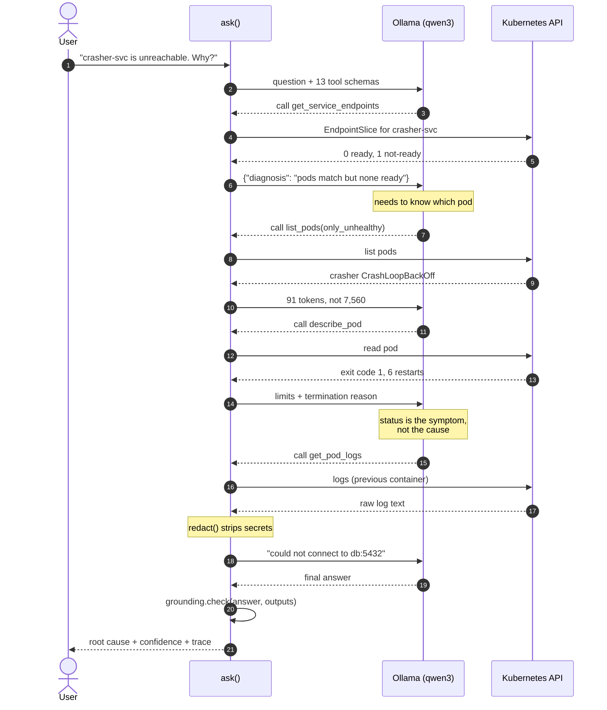
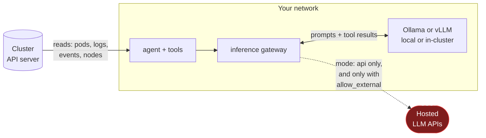

# Architecture

Five entry points share one set of tools. The tools are plain Python functions
returning JSON-able dicts, which is what lets them serve as REST handlers,
model tools, MCP tools and UI panels with no adapter in between.

They also share one inference gateway. Where the model runs -- a workstation,
this cluster, or a vendor -- is configuration rather than code, and the loop
below cannot tell which it has. See [INFERENCE.md](INFERENCE.md).

```mermaid
flowchart TB
    subgraph clients [Entry points]
        CLI["agent.py<br/>CLI + --scan"]
        API["app.py<br/>FastAPI"]
        MCP["mcp_server.py<br/>MCP stdio/HTTP"]
        CTL["controller.py<br/>watch, unprompted"]
        UI["ui.py<br/>Streamlit"]
    end

    subgraph loop [Agent loop]
        ASK["stream() / ask()<br/>bounded by MAX_ROUNDS"]
        GRD["grounding.check()<br/>verifies claims"]
    end

    subgraph tools [Tools · routers/]
        HOST["Host<br/>psutil"]
        K8S["Kubernetes<br/>client-go API"]
        RED["redaction.redact()"]
    end

    subgraph inf [Inference]
        GW["inference.py<br/>mode · egress policy · fallback"]
        BE["backends.py<br/>ollama · openai · vllm"]
    end

    MODEL["Model<br/>local, in-cluster<br/>or hosted"]
    CLUSTER[("Kubernetes<br/>API server")]

    CLI --> ASK
    CLI -.--scan, no model.-> tools
    API --> ASK
    API -.direct, no model.-> tools
    CTL --> ASK
    UI --> ASK
    UI -.direct, no model.-> tools
    MCP ==>|"tools exposed<br/>to any MCP client"| tools

    ASK <-->|"tool_calls / results"| GW
    GW --> BE
    BE <--> MODEL
    ASK --> tools
    ASK --> GRD

    K8S --> RED
    HOST --> tools
    K8S -->|"read-only<br/>15s timeout"| CLUSTER

    classDef sec fill:#7f1d1d,stroke:#ef4444,color:#fff
    class RED,GW sec
```

The MCP path deliberately bypasses the loop: an MCP client brings its own
model, so it wants the tools, not another agent.

## A diagnosis, step by step

This is the real chain from the service-unreachable eval case. Note the model
never sees the cluster; it only sees projections, and each call is chosen from
what the previous one returned.



## Why projection is the load-bearing decision

The model has a fixed context budget. Everything else follows from that.

| Payload | Tokens |
| --- | --- |
| Raw `list_namespaced_pod`, 5 pods | ~7,560 |
| `list_pods(only_unhealthy=True)` | ~91 |
| Raw `list_pod_for_all_namespaces`, 19 pods | ~33,042 |
| `scan_cluster()`, same cluster | ~146 |

Token counts are `len(response_body) // 4` over the raw JSON the API server
sends, which is what the 7,560 figure above was measured with. Counting
`str(obj.to_dict())` instead inflates it about 1.8× — worth stating, because
the two methods disagree enough to change a conclusion.

At ~1,500 tokens per raw pod, a 50-pod namespace exceeds qwen3's entire 40k
window in a single call — before the model has reasoned about anything. Every
tool therefore returns only the fields a diagnosis depends on. A test asserts
a token ceiling so this cannot silently regress.

`scan_cluster` is where this binds hardest, because its input is the whole
cluster rather than one namespace: a 19-pod kind cluster is already 33k raw
tokens, so the raw form was never an option at any useful cluster size. It
survives by projecting twice — first to the fields a diagnosis needs, then by
grouping pods into owning workloads, which is what stops a 200-replica
deployment from costing 200 lines.

The wire cost does not projection away, though. The API server still sends
every pod: ~7KB each, so ~7MB for a 1,000-pod cluster, on every scan. That is
3ms on kind over loopback and something quite different over a VPN. There is
no server-side fix — the interesting pods are `phase: Running` with a waiting
container, so no field selector can narrow the query.

The cost is real: projections discard information, so a fault that hinges on a
field we dropped is invisible. The fields were chosen from the failure modes
in `demo/`, which is a sample of convenience, not a survey.

## Trust boundaries



**By default nothing crosses that line, and the default is enforced rather
than documented.** `inference.py` refuses an endpoint off your network unless
`TRIAGE_ALLOW_EXTERNAL_INFERENCE` is set, refuses a mode whose label claims
on-network while its endpoint is not, and refuses to treat a fallback as a way
around either. `networkPolicy.enabled=true` makes the same claim where a bug
in that code cannot undo it.

Choosing `mode: api` moves the boundary deliberately: the conversation, which
includes projected pod logs, goes to a vendor. Outbound messages get a second
redaction pass at the boundary on top of the one the collectors already did.

What none of this is: pod logs still enter this process, this terminal and this
machine's memory whatever the mode. `redaction.py` strips common secret shapes
and `deploy/rbac.yaml` limits what the agent can read at all, but "local" is
not the same as "safe to point at prod".

## Deterministic code versus model behaviour

This is the load-bearing distinction in the system, and it is worth stating
plainly: **the model chooses how to investigate; it does not decide what is
true, what it is investigating, or when to stop.** Everything in the left
column runs the same way every time and is covered by unit tests. Everything in
the right column varies between runs and is measured statistically instead.

| Deterministic | Model |
|---|---|
| Which tools exist, and their schemas (`tool_schema.py`) | Which tool to call next |
| Tool arguments, after `targeting.enforce()` rewrites off-target ones | The arguments it proposes |
| What a tool returns — a projection, not raw API objects | How the result is interpreted |
| Redaction, at collection and again at the egress boundary | — |
| Whether a claim is supported, contradicted, unsupported or unknown | Which claims to make |
| The five grounding verdicts | The wording of the answer |
| When the investigation stops (`MAX_ROUNDS`, `TRIAGE_INVESTIGATION_BUDGET`) | When it would like to stop |
| Which endpoint counts as external, and whether egress is permitted | — |
| Whether a run is sent back for evidence it provably lacks | — |
| Failover between providers sharing a wire format | — |

A consequence worth naming: **kubewhy's safety properties do not depend on the
model behaving well.** Swapping `qwen3` for `gpt-4o-mini` changes the answers;
it does not change what the tools may do, where evidence may go, how long a run
may take, or how a claim is scored.

## The agent loop

`agent.stream()` yields every step as it happens; `agent.ask()` is that drained
to completion, so the two cannot drift. Each event carries a `run_id`, and the
answer carries the `target`, so a caller can check that the artifacts in front
of it belong to the investigation it asked for rather than assuming so.

One round is: send messages → receive tool calls or a final answer → for each
tool call, enforce scope, execute, project, append the result → repeat.

Three deterministic things can send a round back:

- **named-tool re-ask** — the answer names a tool it never called
- **evidence policy** — `evidence_gap()` finds a pod whose cause is provably not
  in its status block and which the run never read. Events hold the cause for a
  container that never started; logs hold it for one that started and exited.
  They are not interchangeable.
- **coverage** — the summary omits workloads the scan returned

## Tool registry

Plain Python functions returning JSON-able dicts. That is what lets one
definition serve as a REST handler, a model tool, an MCP tool and a UI panel
with no adapter. `tool_schema.py` derives JSON Schema from the same callables
Ollama introspects, so there is one definition and two consumers rather than
two definitions that drift.

**Every tool is read-only.** There is no write path, no `kubectl apply`, no
scale, no delete. `errors come back as {"error": ...} data and are never
raised`, so a failing tool costs a round rather than the run.

## Targeting and entity scope

`targeting.py` extracts the entity a question is about and holds it fixed. Every
tool call is checked against it: a call that would widen or move the scope is
rewritten where the arguments allow and refused where they do not.

A surface that already knows its target — the console, which has a selection —
passes it as data via `agent.scoped_target()`. Parsing is reserved for surfaces
that genuinely have only a sentence. That split exists because re-deriving the
target by parsing a generated prompt produced a workload called `example`; see
[VALIDATION.md](VALIDATION.md).

## Grounding and contradiction

Two stages, deliberately separate:

- `grounding.check()` asks **does the evidence contain this value?**
- `contradiction.scan()` asks **does the evidence say something else?**

"The tools did not say" and "the tools said otherwise" are different, and only
the second means the answer is wrong. Five verdicts: `grounded`, `partial`,
`ungrounded`, `insufficient_evidence`, `contradicted`. `grounding.contract()`
splits the result into observations (each citing tool and field), inferences,
unknowns, contradictions and corrections — which is what the console renders.

`grounding.verify()` rewrites an unsupported figure **in place** in the answer
text, so a reader skimming for a number finds the measured one or an explicit
`[unverified: ...]` marker rather than a fabricated value.

## Inference gateway

`backends.py` is the protocol; `inference.py` is where inference happens, plus
egress policy, failover and telemetry. `Gateway` presents the same four methods
a backend does, so `agent._backend()` returns one and the loop is unchanged.

- **Endpoint classification** decides internal vs external on the name *as
  written*, never resolved. The classifier and the HTTP client normalise through
  the same parser, by construction — two parsers on one string agree only by
  coincidence, and that gap was once an exploitable egress bypass.
- **Failover** is wire-aware: mid-run only between providers sharing a wire
  format, because a conversation half in one dialect is not resumable in
  another.
- **One deadline per investigation**, shared across primary and fallback. A
  fallback cannot reset it; when the budget is exhausted the fallback is skipped
  and logged as `fallback_skipped_deadline_exhausted`.

## Policy boundaries

| Boundary | Enforced by |
|---|---|
| Cluster reads | ClusterRole with no write verbs |
| What leaves the process | `redaction.redact()` at collection and at egress |
| Where inference may go | `TRIAGE_ALLOW_EXTERNAL_INFERENCE` + endpoint classification |
| What the dataplane permits | `networkPolicy.enabled=true` in the chart |
| How long a run may take | `TRIAGE_INVESTIGATION_BUDGET`, one deadline per `chat()` |

## Presentation layer

`ui.py`, a single Streamlit page, rendered server-side. The browser holds no
Kubernetes client and no provider credential. **The view computes no verdict** —
every field is read from what `stream()` returned and `contract()` produced.
See [UI.md](UI.md).
