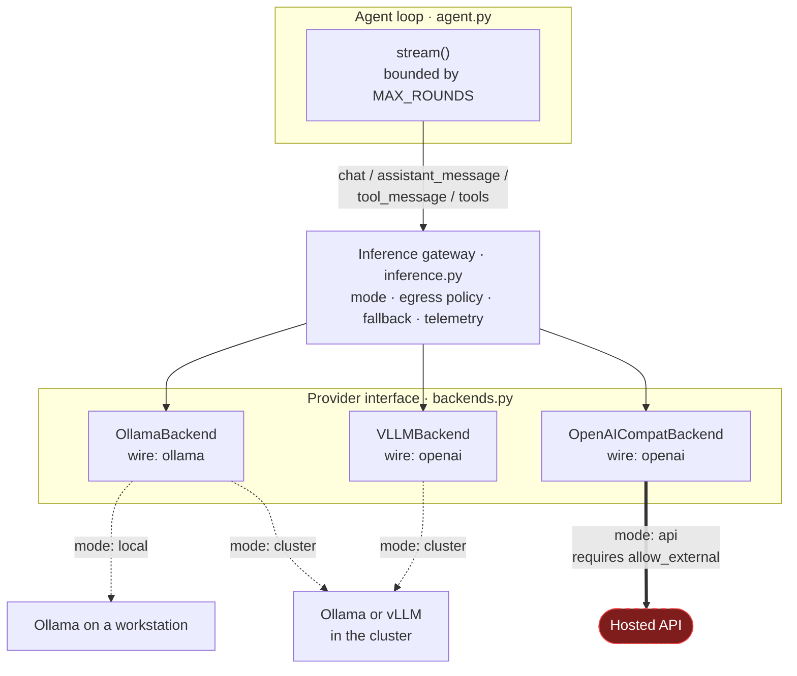

# Inference

Where the model runs, what may reach it, and what happens when it cannot be
reached.

kubewhy's default claim is that nothing leaves your network. That claim costs
a GPU per cluster, and for some organisations that is the wrong trade — so
this is a choice rather than a property of the product. The choice is made in
configuration; no application code changes between the three modes.

## The three modes

| mode | the model runs | evidence leaves your network | typical use |
| --- | --- | --- | --- |
| `local` | outside the cluster, usually a workstation | no | laptop, lab, disconnected troubleshooting |
| `cluster` | inside the cluster, reached by Service DNS | no | the deployed default |
| `api` | at a vendor | **yes** | no GPU budget, or a model you cannot self-host |



The loop calls four methods and cannot tell which of these it has. That is the
seam: `Gateway` presents exactly the interface a backend does, and a test
asserts it, because if it ever stops being true then `agent.py` has to learn
something about inference.

## The mode is checked, not trusted

It would be easy to make `mode` a label that picks an endpoint and means
nothing else. Then this:

```yaml
inference:
  mode: cluster
  endpoint: https://api.openai.com/v1
```

would install cleanly, report itself as in-cluster inference in every log line,
and ship pod logs to a vendor.

So the mode is checked against the endpoint. `local` and `cluster` claim
inference stays on your network; if the endpoint is off it, the process
refuses to start and the chart refuses to render.

The asymmetry is deliberate: `api` mode pointed at a **local** endpoint is
allowed. Claiming more egress than occurs is never the unsafe direction — and
it is how the OpenAI-protocol backend gets validated against a local Ollama
without a key or a bill.

Classification is done on the endpoint **as written** and never resolves it. A
DNS lookup gives an answer that can change between the check and the request,
and a policy decision that depends on the current answer cannot be audited
afterwards. The consequence is stated rather than hidden:

- a public name resolving to a private address reads as external here — a
  false alarm you can override with `allowExternal`;
- a private name resolving publicly reads as internal — the real limitation,
  and the reason `allowExternal` is a separate switch rather than something
  inferred.

Internal means: loopback, RFC1918 or link-local addresses, a `.svc` /
`.cluster.local` / `.internal` suffix, or a single-label host (a bare `ollama`
is a Service or a compose alias — a public name needs a dot).

## Providers

| provider | protocol | `wire` | status |
| --- | --- | --- | --- |
| `ollama` | Ollama native | `ollama` | the default, and the only one whose eval numbers this project has measured |
| `openai` | OpenAI chat-completions | `openai` | validated against a local Ollama `/v1`. **The hosted service is untested.** |
| `vllm` | OpenAI chat-completions | `openai` | **untested against a real vLLM server** |

`vllm` is the same protocol as `openai` under its own name, and it is a
subclass rather than a dict alias for one reason: the telemetry has to answer
"which provider answered this?" truthfully, and an alias would make every
in-cluster vLLM run report itself as `openai` — the one word that, in this
project, means the evidence left the network.

## Configuration

Every setting is an environment variable. The Helm chart renders them from an
`inference:` block; nothing is hard-coded and no API key is ever a literal env
value.

| variable | default | meaning |
| --- | --- | --- |
| `TRIAGE_INFERENCE_MODE` | `local` | `local` \| `cluster` \| `api` |
| `TRIAGE_INFERENCE_PROVIDER` | per mode | `ollama` \| `vllm` \| `openai` |
| `TRIAGE_INFERENCE_ENDPOINT` | per mode | the base URL |
| `TRIAGE_MODEL` | `qwen3` | the model name the provider serves |
| `TRIAGE_ALLOW_EXTERNAL_INFERENCE` | `false` | permits evidence to leave your network |
| `TRIAGE_REDACT_ON_EGRESS` | `true` | second redaction pass at the boundary |
| `TRIAGE_FALLBACK_ENABLED` | `false` | |
| `TRIAGE_FALLBACK_MODE` / `_PROVIDER` / `_ENDPOINT` / `_MODEL` | — | the fallback target |
| `TRIAGE_FALLBACK_API_KEY` | `OPENAI_API_KEY` | |
| `TRIAGE_PRIMARY_RETRY_SECONDS` | `60` | how long a failed primary is skipped |
| `OPENAI_API_KEY` | — | credential for an OpenAI-protocol provider |
| `OLLAMA_TIMEOUT` | `300` | seconds |

**Older variables still work and still mean what they meant.** `TRIAGE_BACKEND`
named a protocol, which is narrower than a mode, and is read as one: `ollama`
→ local, `openai` → api, `vllm` → cluster. `OLLAMA_HOST` is still the endpoint
for the ollama provider when `TRIAGE_INFERENCE_ENDPOINT` is unset — that one
matters more than it looks, because the Helm chart sets it and nothing else.
Reading it in `inference.py` rather than letting the Ollama client pick it up
quietly is what lets the egress check see the address at all.

## Local development

```bash
ollama serve &
ollama pull qwen3
python agent.py "what is broken in the demo namespace?"
```

That is `mode: local` with everything on its defaults. To exercise the
OpenAI-protocol path without a key or a bill, point it at the same server:

```bash
TRIAGE_INFERENCE_MODE=api \
TRIAGE_INFERENCE_ENDPOINT=http://localhost:11434/v1 \
python agent.py "what is broken in the demo namespace?"
```

Same model, same cluster, two wire formats — so any difference between the two
runs is the seam rather than the model. This is how the second backend was
validated, and it is the cheapest reproduction of a hosted-API code path there
is.

## Kubernetes deployment

**Agent + in-cluster Ollama** (the chart runs both):

```bash
helm install kubewhy deploy/chart \
  --set ollama.enabled=true --set ollama.namespace=ollama
```

**Agent + in-cluster vLLM:**

```bash
helm install kubewhy deploy/chart \
  --set vllm.enabled=true \
  --set inference.provider=vllm \
  --set inference.endpoint=http://vllm.default.svc.cluster.local:8000/v1 \
  --set inference.model=Qwen/Qwen2.5-7B-Instruct
```

GPU is optional and off. `vllm.gpuCount=0` runs on ordinary nodes, which is
slow enough to be a demo rather than a deployment — measured on Ollama, an
eight-core CPU node needed ~128s per diagnosis with thinking off and exceeded a
300s timeout without a first token with it on.

**Agent using a hosted API only** (no GPU anywhere):

```bash
kubectl create secret generic openai-key --from-literal=api-key=sk-...
helm install kubewhy deploy/chart \
  --set inference.mode=api \
  --set inference.allowExternal=true \
  --set inference.model=gpt-4o-mini \
  --set inference.apiKey.existingSecret=openai-key
```

Leaving out `allowExternal` fails the install with an explanation rather than
producing a CrashLoopBackOff twenty minutes later.

## Fallback

Off by default. When enabled, an unavailable primary is retried once on the
fallback.

```yaml
inference:
  mode: cluster
  allowExternal: true          # the fallback below leaves your network
  fallback:
    enabled: true
    mode: api
    model: gpt-4o-mini         # required: see below
    apiKey:
      existingSecret: openai-key
```

Four rules, and each exists because the obvious version is wrong:

**A fallback is not a way around the policy.** If the fallback is external it
needs `allowExternal` exactly as a primary does. A `PermissionError` is never
failed over.

**Unavailable is not the same as refusing.** A timeout, a refused connection, a
502 or a 429 are the provider being unable, and are what a fallback is for. A
400 is a malformed request and a 401 is a wrong key: both fail identically on
the fallback, and succeeding quietly elsewhere would hide a configuration error
someone has to see. Those are raised.

**A fallback needs its own model name.** It is a different provider serving a
different catalogue. Inheriting `qwen3` produces a 404 at the one moment the
primary is already down.

**Mid-run failover only happens between providers sharing a wire.** Halfway
through an investigation the message history is in the primary's shape —
Ollama `Message` objects with results matched by `tool_name`, or dicts matched
by `tool_call_id`. Handing that to a provider speaking the other protocol is a
400 that reads as the fallback being broken. Across wires, the fallback can
only take a run that has not started. That is a narrower guarantee than "we
fail over", and it is the true one.

A primary that fails is then skipped for `TRIAGE_PRIMARY_RETRY_SECONDS`. Found
by running it: without that, one investigation failed over on *every round*.
With a refused connection that costs milliseconds and is invisible; with a
primary that times out it is `MAX_ROUNDS × OLLAMA_TIMEOUT` — forty minutes of
learning eight times that the model is still down.

## What leaves, and what does not

Only `mode: api` sends anything off your network, and only with
`allowExternal`. What it sends is the conversation: the system prompt, the
question, and the projected tool results the model needs to reason over — which
includes pod logs.

Two things stand between those and a vendor's request log:

- pod logs are redacted where they are collected (`redaction.py`), and
- every outbound message is run through the same filter again at the boundary.

The second pass is defence in depth, not the only defence. It uses the *same*
filter rather than its own pattern list, because a boundary pass that drifted
from the collection pass would stop catching exactly the shapes nobody was
watching. It is skipped entirely for requests that never leave, because
redaction is lossy and paying that cost on an internal request buys nothing.

None of this is a guarantee. `redaction.py` is pattern matching and a novel
secret format passes through. If your logs must never reach a third party, the
answer is `mode: local` or `mode: cluster`, and `networkPolicy.enabled=true`
to make that a property the dataplane enforces rather than one this process
promises.

## Observability

`/metrics` serves Prometheus exposition, behind the same bearer token as the
rest of the API.

| metric | labels |
| --- | --- |
| `kubewhy_inference_requests_total` | mode, provider, model, outcome |
| `kubewhy_inference_duration_seconds` | mode, provider, model |
| `kubewhy_inference_tokens_total` | mode, provider, model, kind |
| `kubewhy_inference_fallbacks_total` | from_provider, to_provider, reason |
| `kubewhy_inference_egress_denied_total` | mode, provider |
| `kubewhy_tool_calls_total` | tool, outcome |
| `kubewhy_investigations_total` | outcome (the grounding verdict) |
| `kubewhy_investigation_duration_seconds` | — |

Endpoints are never labels: one can carry a token in its userinfo or its query
string. The provider name is enough to say where a request went, and it is the
part an operator can act on. Token counts are **absent** rather than zero for a
provider that reports none — a zero would read as "this call used no tokens",
which is a different and false claim.

`/inference` reports the configured mode, provider, model, destination and
policy. It exists because that was previously answerable only by reading the
pod's environment, and the answer changes what the deployment is claiming about
your data.

## Troubleshooting

**`/readyz` returns 503.** The body names which target failed and with what
exception class. `mode: local` from inside a pod is the common one: a
container's `localhost` is its own, so the endpoint has to be an address the
pod can route to.

**403 from `/ask` with "refusing to send cluster evidence".** The endpoint is
off-network and `TRIAGE_ALLOW_EXTERNAL_INFERENCE` is unset. Deliberate — a 403
reads as a decision, where a 500 would read as a bug and get retried.

**The pod refuses to start with "says inference stays on your network".** The
mode and the endpoint disagree. Either point the endpoint on-network, or set
`mode: api` and say what you are doing.

**Answers got worse after changing provider.** Expected, and re-score rather
than guessing. `grounding.py` is calibrated to how qwen3 writes —
`KNOWN_STATUSES`, `_TOOL_SPELLINGS`, `KNOWN_CAUSES` and the `_PRESCRIPTIVE`
regexes all exist because of observed output — so a different model keeps
producing verdicts, just less accurate ones. Re-run `grounding.check(record["draft"],
record["evidence"])` over recorded runs and read *why* each flag fired rather
than comparing pass rates. Then the policy budgets (`MAX_ROUNDS`,
`MAX_NUDGES`), which were tuned to qwen3's tool-calling rhythm.

**Everything is slow.** Thinking mode is where essentially all of this agent's
latency goes: 7.1× on the median across sixteen cases, and every one of them
slower. `TRIAGE_THINK=false` trades some accuracy for it — how much is
[still not settled](../NEXT-SESSION.md), across three undetermined rounds.

## Adding a provider

Two files, and a number.

1. **`backends.py`** — a class with `name`, `wire`, and four methods: `chat`,
   `assistant_message`, `tool_message`, `tools`. Register it in `_BACKENDS`.

   The third method is the one that bites. A backend owns the *wire shape of
   messages*, not just the reply, because providers disagree there in ways the
   loop must not care about. Give it a `wire` matching an existing one only if
   the message shapes are genuinely interchangeable — that string is what
   decides whether a mid-run failover is possible.

   Tool schemas come from `tool_schema.schemas_for()`, derived from the same
   Python callables Ollama introspects. Do not hand-write them: those
   docstrings are prompt engineering, and a schema whose description has
   fallen a refactor behind changes tool selection without changing a test.

2. **`inference.py`** — nothing, usually. `DEFAULT_PROVIDER` and
   `DEFAULT_ENDPOINT` only need an entry if the provider should be a mode's
   default.

3. **The number.** A backend is not done when it runs. The suite in `evals/`
   is the only check on a model change: 16 cases, the controller, and
   grounding. A backend added without those numbers is unverified, whatever
   its unit tests say.

## Adding a cloud or Kubernetes adapter

There is deliberately nothing to add for GKE, EKS or AKS today, and that is
worth stating precisely because it is easy to mistake for an oversight.

Every collector in `routers/` uses the standard Kubernetes API through the
official client. There is no cloud SDK in `requirements.txt`, no metadata-server
call, and no provider conditional. The agent authenticates with whatever the
kubeconfig or the mounted ServiceAccount token provides, which is how every
managed platform expects a workload to authenticate.

`docs/PORTABILITY.md` records what that is worth: validated on GKE at level 3,
audited but not run on EKS and AKS. The audit found no EKS-specific dependency,
which is a statement about the source and not about EKS.

**When you do need an adapter**, the shape is the same as `backends.py`: put
the provider-specific code behind an interface the rest of the system already
speaks, keep the default path free of it, and give it a `name` the telemetry
can report truthfully. The one portability bug GKE actually produced is the
template — `list_nodes` reported every healthy Container-Optimized OS node as
under `pressure`, because such a node carries 26 conditions and
`SysctlChanged` is `True` by design. The fix was an allowlist of the pressure
conditions, not a GKE branch. Prefer that shape: node conditions are an open
set, and so is most of what distinguishes one managed platform from another.
