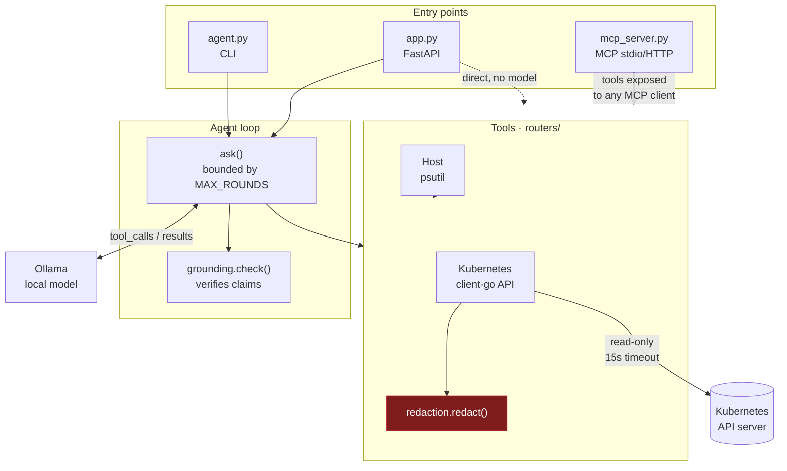
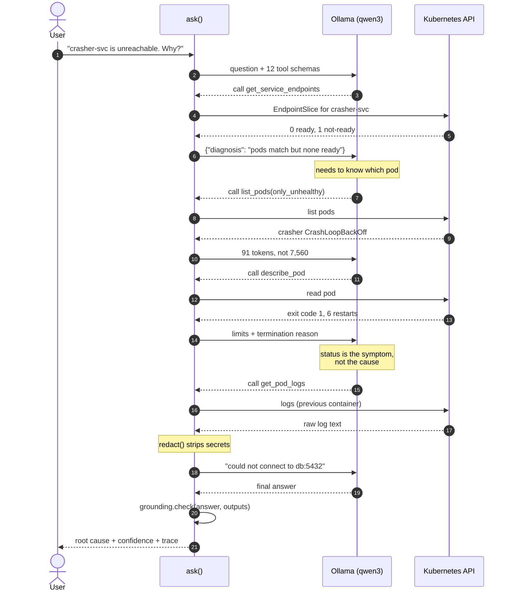
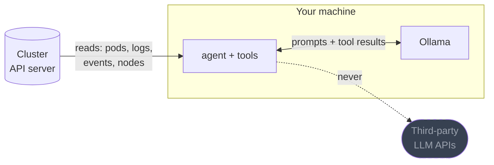

# Architecture

Three entry points share one set of tools. The tools are plain Python
functions returning JSON-able dicts, which is what lets them serve as REST
handlers, Ollama tools and MCP tools with no adapter in between.

The MCP path deliberately bypasses the loop: an MCP client brings its own
model, so it wants the tools, not another agent.

## A diagnosis, step by step

This is the real chain from the service-unreachable eval case. Note the model
never sees the cluster; it only sees projections, and each call is chosen from
what the previous one returned.

## Why projection is the load-bearing decision

The model has a fixed context budget. Everything else follows from that.

| Payload | Tokens |
| --- | --- |
| Raw `list_namespaced_pod`, 5 pods | ~7,560 |
| `list_pods(only_unhealthy=True)` | ~91 |

At ~1,500 tokens per raw pod, a 50-pod namespace exceeds qwen3's entire 40k
window in a single call — before the model has reasoned about anything. Every
tool therefore returns only the fields a diagnosis depends on. A test asserts
a token ceiling so this cannot silently regress.

The cost is real: projections discard information, so a fault that hinges on a
field we dropped is invisible. The fields were chosen from the failure modes
in `demo/`, which is a sample of convenience, not a survey.

## Trust boundaries

Inference is local, so prompts and cluster data never reach a third party.
That is the guarantee. What it is *not*: pod logs still enter this process,
this terminal and this machine's memory. `redaction.py` strips common secret
shapes first, and `deploy/rbac.yaml` limits what the agent can read at all,
but "local" is not the same as "safe to point at prod".
